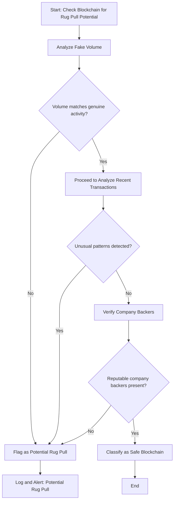

# DevDocNoRug

DevDocNoRug is a Solidity smart contract designed to analyze and assess the risk of blockchain projects being potential rug pulls. The contract evaluates projects based on trust scores, backing entities, and other descriptive factors, providing users with a clear risk assessment.  

Deployed on **Polygon**, this contract is a valuable tool for investors, developers, and analysts in the blockchain space.  

---

## 🚀 Features

- **Blockchain Risk Assessment**:  
  Analyzes blockchains based on trust scores and backing entities to determine their potential risk.  

- **Listed Blockchains**:  
  Maintains a curated list of blockchains with detailed descriptions and risk evaluations.  

- **Risk Levels**:  
  Categorizes projects into **LOW RISK**, **MEDIUM RISK**, and **HIGH RISK** based on their trust scores.  

---

## 📂 Smart Contract Details

### Key Functions

1. **`addBlockchain`**  
   Adds a blockchain to the list with a trust score, description, and risk assessment.  
   **Access Control**: Only the owner can call this function.  

2. **`checkBlockchain`**  
   Retrieves the risk assessment of a specified blockchain, including its trust score and backing entity.  

3. **`getAllBlockchains`**  
   Lists all blockchains stored in the contract with their names and trust scores.  

4. **`uint2str` (Internal)**  
   Converts `uint` values (e.g., trust scores) into strings for better data presentation.  

### Events

- **`BlockchainChecked`**:  
  Emits details whenever a blockchain is analyzed.  

---

## 🛠️ Deployment

The contract is deployed on the **Polygon** network. Here are the key details:  

- **Network**: Polygon Mainnet  
- **Contract Address**: `<YOUR_DEPLOYED_CONTRACT_ADDRESS>`  
- **Compiler Version**: `0.8.19`  
- **License**: MIT  

---

## 🚨 How It Works

1. **Add Blockchains**:  
   The owner can add both legitimate and suspicious blockchains with attributes like trust score, backing entity, and a brief description.  

2. **Analyze Blockchains**:  
   Users can call the `checkBlockchain` function to retrieve an analysis, including:  
   - Risk Level: LOW, MEDIUM, HIGH  
   - Trust Score: (0–100)  
   - Backing Entity: Known backer or "Unknown"  
   - Description: Insights into the project’s legitimacy  

3. **List All Blockchains**:  
   Users can call `getAllBlockchains` to view all blockchains currently tracked by the contract.  

---
## Code

// SPDX-License-Identifier: MIT
pragma solidity ^0.8.19;

contract RugPullDetector {
    struct BlockchainInfo {
        string name;
        bool isRugPull;
        uint256 trustScore;
        string backedBy;
        bool isListed;
        string description;
    }

    mapping(string => BlockchainInfo) public blockchains;
    string[] public listedBlockchains;
    address public owner;

    event BlockchainChecked(
        string name,
        bool isRugPull,
        uint256 trustScore,
        string backedBy,
        string description
    );

    constructor() {
        owner = msg.sender;
        
        // Add legitimate blockchains
        addBlockchain(
            "Ethereum",
            false,
            95,
            "Ethereum Foundation",
            "Leading blockchain platform with strong community and proven track record"
        );
        
        addBlockchain(
            "Polygon",
            false,
            90,
            "Polygon Labs",
            "Established Layer 2 solution with major partnerships"
        );
        
        addBlockchain(
            "Binance",
            false,
            85,
            "Binance",
            "Major exchange-backed blockchain with large ecosystem"
        );

        // Add suspicious blockchains
        addBlockchain(
            "SafeMoonChain",
            true,
            30,
            "Unknown",
            "High risk indicators: Unrealistic promises, anonymous team"
        );
        
        addBlockchain(
            "ElonDoge",
            true,
            20,
            "Anonymous",
            "Multiple red flags: Celebrity marketing, no clear use case"
        );
        
        addBlockchain(
            "QuickRichChain",
            true,
            10,
            "None",
            "High risk: Promises unrealistic returns, no technical documentation"
        );
    }

    modifier onlyOwner() {
        require(msg.sender == owner, "Not owner");
        _;
    }

    function addBlockchain(
        string memory name,
        bool isRugPull,
        uint256 trustScore,
        string memory backedBy,
        string memory description
    ) public onlyOwner {
        require(trustScore <= 100, "Trust score must be between 0 and 100");
        
        BlockchainInfo memory newChain = BlockchainInfo({
            name: name,
            isRugPull: isRugPull,
            trustScore: trustScore,
            backedBy: backedBy,
            isListed: true,
            description: description
        });
        
        blockchains[name] = newChain;
        listedBlockchains.push(name);
    }

    function checkBlockchain(string memory name) public returns (string memory) {
        BlockchainInfo memory chain = blockchains[name];
        
        if (!chain.isListed) {
            return string(abi.encodePacked(
                "Blockchain '",
                name,
                "' not found in our database. Please check the listed blockchains using getAllBlockchains()"
            ));
        }

        emit BlockchainChecked(
            chain.name,
            chain.isRugPull,
            chain.trustScore,
            chain.backedBy,
            chain.description
        );

        string memory riskLevel;
        if (chain.trustScore >= 80) {
            riskLevel = "LOW RISK";
        } else if (chain.trustScore >= 50) {
            riskLevel = "MEDIUM RISK";
        } else {
            riskLevel = "HIGH RISK";
        }

        return string(abi.encodePacked(
            "=== Blockchain Analysis Results ===\n",
            "Name: ", chain.name, "\n",
            "Risk Assessment: ", riskLevel, "\n",
            "Trust Score: ", uint2str(chain.trustScore), "/100\n",
            "Backed By: ", chain.backedBy, "\n",
            "Potential Rug Pull: ", chain.isRugPull ? "YES" : "NO", "\n",
            "Description: ", chain.description
        ));
    }

    function getAllBlockchains() public view returns (string memory) {
        string memory result = "=== Listed Blockchains ===\n";
        
        for (uint i = 0; i < listedBlockchains.length; i++) {
            string memory name = listedBlockchains[i];
            BlockchainInfo memory chain = blockchains[name];
            
            result = string(abi.encodePacked(
                result,
                uint2str(i + 1), ". ", 
                chain.name, " (Trust Score: ", 
                uint2str(chain.trustScore), 
                ")\n"
            ));
        }
        
        return result;
    }

    // Utility function to convert uint to string
    function uint2str(uint _i) internal pure returns (string memory) {
        if (_i == 0) {
            return "0";
        }
        uint j = _i;
        uint len;
        while (j != 0) {
            len++;
            j /= 10;
        }
        bytes memory bstr = new bytes(len);
        uint k = len;
        while (_i != 0) {
            k = k-1;
            uint8 temp = (48 + uint8(_i - _i / 10 * 10));
            bytes1 b1 = bytes1(temp);
            bstr[k] = b1;
            _i /= 10;
        }
        return string(bstr);
    }
}
## 🔍 Example Usage

### Add a Blockchain (Owner Only)
```solidity
addBlockchain(
    "Ethereum",
    false,      // isRugPull
    95,         // trustScore
    "Ethereum Foundation",
    "Leading blockchain platform with strong community and proven track record"
);


=== Blockchain Analysis Results ===
Name: Ethereum
Risk Assessment: LOW RISK

```


Trust Score: 95/100
Backed By: Ethereum Foundation
Potential Rug Pull: NO
Description: Leading blockchain platform with strong community and proven track record


This is the FlowChart:



This README is formatted to provide a clear overview, instructions, and usage examples for developers. Let me know if you'd like to refine it further!


